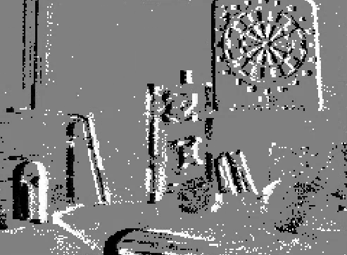

My solutions to exercises from Prof. Guillermo Gallego's course ["Event-based Robot Vision"](https://sites.google.com/view/guillermogallego/teaching/event-based-robot-vision), from Technical University Berlin (TUB).

Details of the exercises are as follow:

1. A simple introduction to image processing with OpenCV in python; code in `imgproc_py` directory. 
2. A notebook containing visualisations of many common representations of event data; code in the `events_viz` directory.
3. A ROS node for visualising event data as either: brightness-increment images, or overlaid over color frame. Quite similar in functionality to the `dvs_renderer` package from [rpg_dvs_ros](https://github.com/uzh-rpg/rpg_dvs_ros/). My package can be found in `evis_ws/src/dvs_displayer`.
4. An implementation of Cedric Scheerlinck et al.'s [paper](https://arxiv.org/abs/1811.00386/) to reconstruct images from events asynchronously, visualised in the GIF above. My package can be found in `evis_ws/src/dvs_integrator`.
5. An extension to the previous, focused on implementing asynchronous spatial convolution of event data and subsequent reconstruction. My package can be found in `evis_ws/src/dvs_integrator_conv`.
6. A ROS node for computing a global optical flow vector for the image, by contrast maximisation. This node is implemented in Python to allow me to prototype faster, but a C++ node maybe developed later on. Note while building the workspace to **NOT** use the `--symlink-install` option as it fails and breaks the workspace due to the `ament_cmake_python` build tool. Use the `clean_build.bash` script in case your build breaks.
7. Not started yet

The solutions for exercises 3 to 5 (`evis_ws`) are implemented in ROS2, as opposed to the professor's provided code in ROS1. To ensure compatibility, I've ported the `dvs_msgs` package from the RPG's [rpg_dvs_ros](https://github.com/uzh-rpg/rpg_dvs_ros) repo. To convert any ROS1 bag, including the one used in this exercise, to ROS2, install the `rosbags` library from pip and convert it using the following command (ensuring the executable is in your path):

```bash
rosbags-convert --src <ros1_bag_name>.bag --dst <ros2_bag_folder name>
```

To run this bag, you must ensure to source the workspace containing `dvs_msgs`. Example instructions for the bag I used are as follows:

```bash
cd evis_ws
./clean_build.bash # script to build dvs_msgs first
source install/setup.bash
wget http://rpg.ifi.uzh.ch/datasets/davis/slider_depth.bag
rosbags-convert --src slider_depth.bag --dst slider_depth_ros2
ros2 bag play -l slider_depth_ros2/slider_depth_ros2.db3
```

The code has been tested on Ubuntu 22.04 with ROS Humble and python3.10, and the jupyter notebooks with python2.7.

My notes on the course, and more, can be found on my [website](https://abban-fahim.github.io/notes/notes/robotics/computer-vision/). 